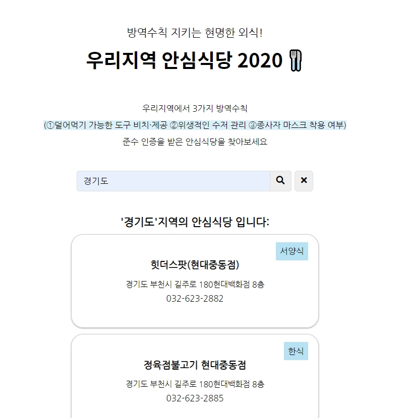

# 안심식당 Finder
농림축산식품부 안심식당 오픈 API을 활용한 코로나19 방역수칙 준수 식당 검색 웹앱 입니다.

  
  

## Demo
<a href="https://eungyeongcha.github.io/safe-restaurant-finder/">[데모보기]</a>

## Resources
* [안심식당 정보](https://data.mafra.go.kr/opendata/data/indexOpenDataDetail.do?data_id=20200713000000001391&service_ty=&filter_ty=G&sort_id=regist_dt&s_data_nm=&cl_code=&instt_id=&shareYn=) - 사용된 오픈 API

